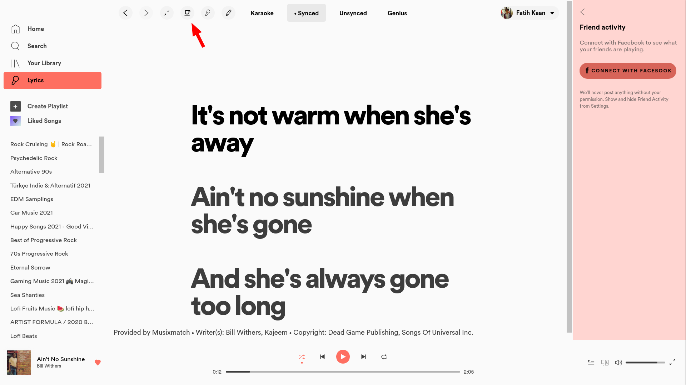
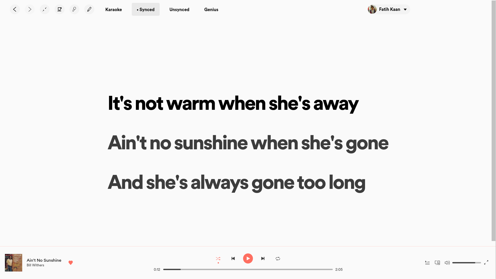

# Spotify Focus Mode

Simple Spotify extension that allows you to hide and show navigation bar and friend activity.

## Installation

- Install [spicetify-cli](https://github.com/khanhas/spicetify-cli)
- Add the `focusMode.js` file (from this repository) to the Extensions folder ([spicetify Extensions](https://github.com/khanhas/spicetify-cli/wiki/Extensions))
- `spicetify config extensions focusMode.js`
- `spicetify apply`

## Enable / Disable Focus Mode

Click on the coffee button (on the upper bar) to toggle focus mode.

